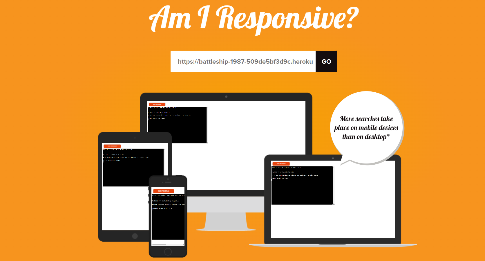
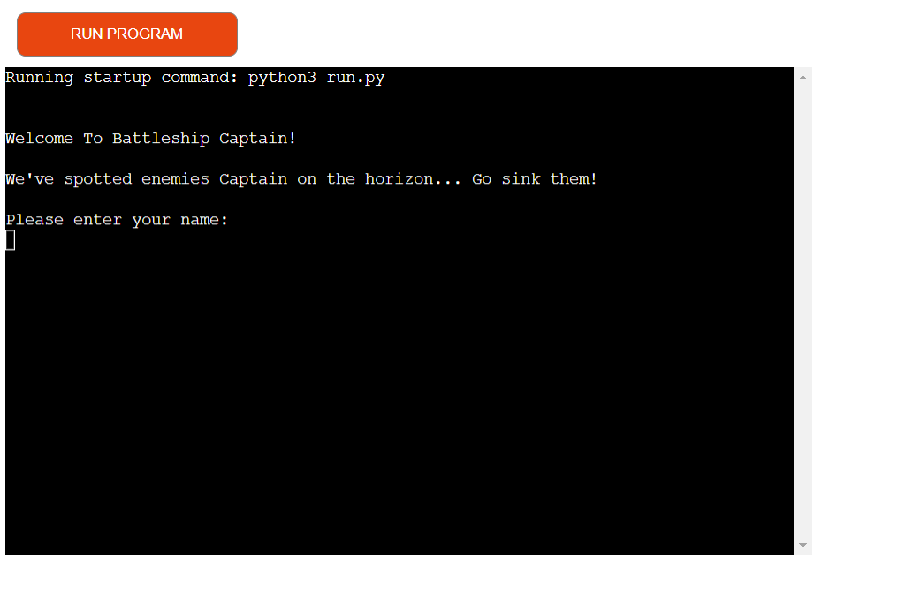
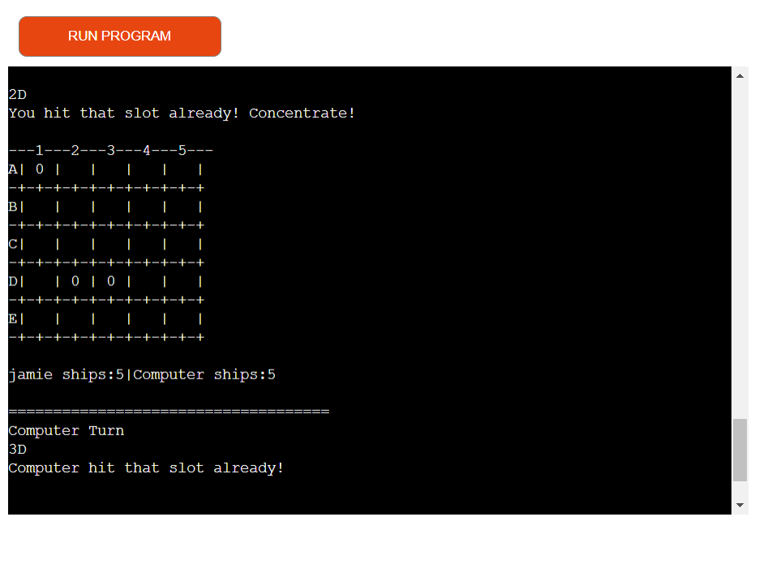
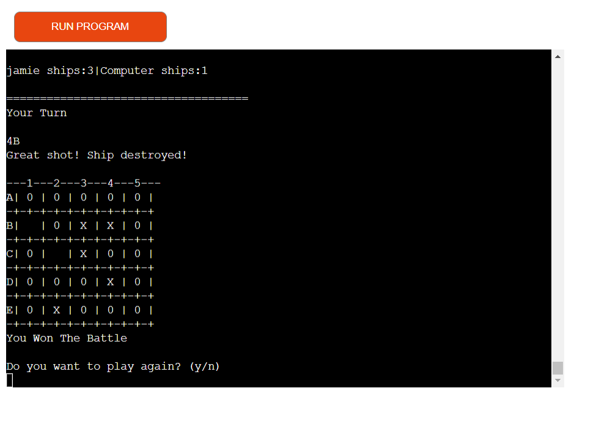
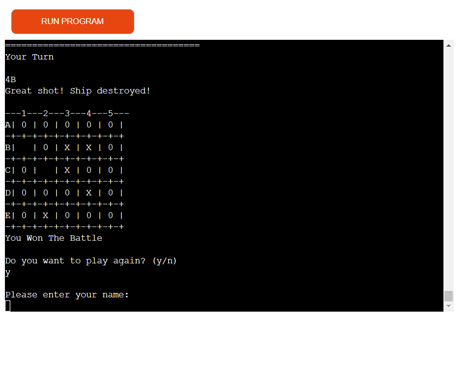
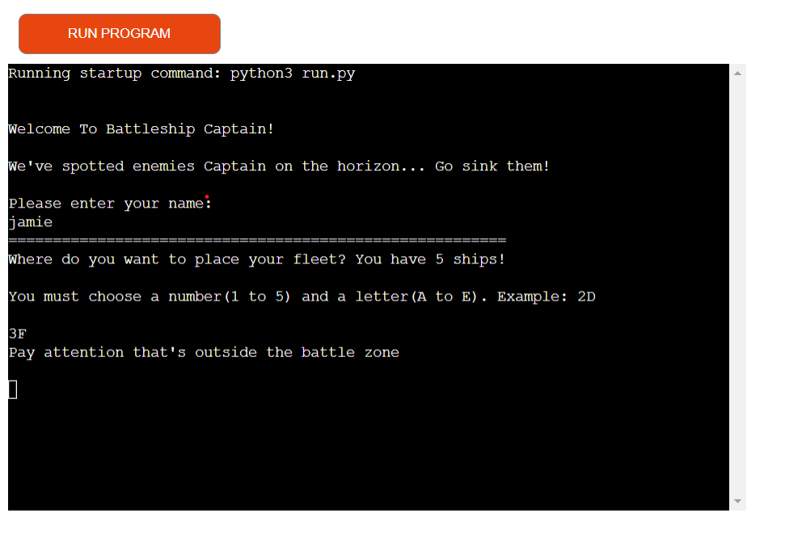
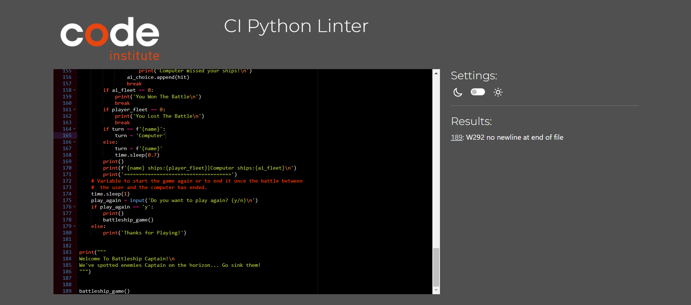

# PORTFOLIO PROJECT - 3

# BATTLESHIP

 Battleship or battleships as it is also known is a strategy type guessing game for two players (or in this case 1 player and the computer). It is played on ruled grids on which each player's fleet of warships are marked. The locations of the fleets are concealed from the other player.

 
 

## INITIAL IDEA CONCEPT

 My initial idea for the project was to create the traditional game of battleships where the user will play against the computer and the computer will randomly select where they firstly place their ships before the game starts. The computer will then randomly try to find where i have placed my ships on the gameboard.

 * Here is a link to the [final project](https://battleship-1987-509de5bf3d9c.herokuapp.com/)

## Flowchart

## USER STORIES

1. As a user, I want to be able to add my name.
2. As a user, I want to be able to place the ships on the board on the slots selected.
3. As a user, I want to be able to see my fleet on the game board.
4. As a user, I want to be able to see how many ships are remaining after every turn.
5. As a user, I want to be able to see on the board when I hit or miss the computer fleet.
6. As a user, I want to be able to see the computers chioces and the result.
7. As a user, I want to be able to see who won the game.
8. As a user, i want to be able to play the game again once the game is complete.

## FEATURES

### Welcome Message

* Shows a welcome message to the user

### Enter your Name

 * The User is able to enter the name that will be displayed in the game.

### Place the fleet

 * The user is able to place 5 ships on the board.

### User Turn

 * The user selects a slot on the board trying to guess where the computer fleet is.
 * Displays a message to the user as a result of the turn.
 * Displays the board with an '0' for missing the ship and an 'X' for destroying one.

### Remaining ships

 * Displays the remaining ships after every turn by the user and computer

### Computer Turn

 * Displays the guess made by the computer.
 * Displays a message with the result of the guess made by the computer.
 * Displays the result after the computer turn.

### Final Result

 * Displays a message with the winner of the battle once one of the player has destroyed the fleet of the other player.

### Restart game 

 * Asks the user to play again or to end the game
 * User can decide to play again ot to end the game
 * Restart the game

### User Input Validation

 * Displays a message to the user for a wrong input.

### Future features:

### Typography

 * Standard terminal font which cannot be changed

# TESTING

## User story testing

1. As a user, I want to be able to add my name.

| **Feature** | **Action** | **Expected Result** | **Actual Result** |
|-------------|------------|---------------------|-------------------|
| Enter your name | Type in your name when asked to do so | The name of the user will be displayed during the game | Works as expected |

2. As a user, I want to be able to place the ships on the board on the slots selected.

| **Feature** | **Action** | **Expected Result** | **Actual Result** |
|-------------|------------|---------------------|-------------------|
| Place the fleet | Place 5 ships on the board | The user is able to place 5 ships on the board on the preferred slots | Works as expected |

3. As a user, I want to be able to see my fleet on the game board.

| **Feature** | **Action** | **Expected Result** | **Actual Result** |
|-------------|------------|---------------------|-------------------|
| Display user's fleet | The ships positioned on the preferred slots by the user will be displayed on the board | The user is able to see the 5 ships on the board | Works as expected |

4. As a user, I want to be able to see how many ships are remaining after every turn.

| **Feature** | **Action** | **Expected Result** | **Actual Result** |
|-------------|------------|---------------------|-------------------|
| Remaining ships | Displays the remaining ships after every turn | Displays the remaining ships after every turn | Works as expected |

5. As a user, I want to be able to see on the board when I hit or miss the computer fleet.

| **Feature** | **Action** | **Expected Result** | **Actual Result** |
|-------------|------------|---------------------|-------------------|
| User Turn | The user selects a slot on the board trying to guess where the computer fleet is | Displays a message to the user as a result of the turn | Works as expected |

6. As a user, I want to be able to see where the computer choices and result.

| **Feature** | **Action** | **Expected Result** | **Actual Result** |
|-------------|------------|---------------------|-------------------|
| Computer Turn | The computer chooses randomly a slot on the board to guess where the user fleet is | Displays the guess made by the computer, and the result | Works as expected |

7. As a user, I want to be able to see who won the game.

| **Feature** | **Action** | **Expected Result** | **Actual Result** |
|-------------|------------|---------------------|-------------------|
| Final Result | The user or the computer has destroyed the last ship from the opponent | Displays a message with the winner of the battle once one of the player has destroyed the fleet of the other player. | Works as expected |

8.  As a user, i want to be able to play the game again once the game is complete.

| **Feature** | **Action** | **Expected Result** | **Actual Result** |
|-------------|------------|---------------------|-------------------|
| Final Result | The user has the option of restarting a new game once the game has ended | Displays a message of do you want to play again (Y for yes and N for no)| Works as expected |

## Validation

### PEP8 Online Validation

PEP8 online was used to check the code for PEP8 requirements.

## Solved bugs and errors

* Throughout the development of this project, several automated errors have been fixed eg:

    * Indentation errors
    * Not enough whitespace between functions
    * No new line at end of file
    

## Unsolved bugs and errors

* No bugs or errors are present

# TECHNOLOGIES

## DEVELOPMENT

* The project was written and tested using [Gitpod](https://gitpod.io/)
* The project uses [Github](https://github.com/) for utilising git version control
* The project was deployed via [Heroku](https://heroku.com/)

## LANGUAGES USED

 * Python 3

## LIBRARIES USED

 * [random](https://docs.python.org/3/library/random.html) to generate the computers placement of ships
 * [time](https://www.programiz.com/python-programming/time) for text delays between user and computer moves

# DEPLOYMENT

## Heroku

* This Game was deployed using [Heroku](https://heroku.com/) with the following the steps:

1. Navigate to [Heroku.com](https://www.heroku.com/) and log-in or create a new account.
2. On the top right hand side, click the 'New' button.
3. Inside the dropdown menu, select 'Create new app'.
4. Create a new name for your app (making sure the name chosen is available) in this case it is `battleship-1987`.
    App names can only be in lower-case letters, numbers and dashes.
5. Select your region, in this case, `Europe`.
6. Click on the `Create App` button.  
7. This will create your app in Heroku and take you to the [Heroku](https://heroku.com/) dashboard.
8. Navigate to the settings tab and scroll down to the button `Reveal Config vars`.
9. Replace the word `KEY` and enter `PORT` and then replace the word `VALUE` and enter `8000` then click on the `Add` button.
10. Below `Config vars` is `Buildpacks`. Click the `Add Buildpack` button.
11. In the pop up window, select `python` and save changes.
12. Repeat this again but this time selecting `node.js` and save the changes.
13. It is `important` to make sure the buildpacks are in the correct order 
    with `Python` being at the top and `node.js` bottom. If they are not in the correct order, you can drag them into the right order.
14. Next, navigate to the `Deploy` tab at the top left side.
15. Select `Github, 'connect to github'` as the deployment method.
16. Search for the Github Repository in the search field (in this case `battleships`) and click `Search`.
17. When the search is complete, click `connect`.
18. Once your repository is connected to [Heroku](https://heroku.com/), Click the `Enable Automatic Deploys` button for automatic deployment.
19. Alternatively you can manually deploy by selecting a branch to deploy from and clicking `Deploy Branch`.
20. If you choose to `Enable Automatic Deploys`, [Heroku](https://heroku.com/) will build a new version of the app when a change to 
    `gitpod` is pushed to `Github`.  
21. Manual deployment allows you to update the app whenever you click `Deploy Branch`.
    In the case of this project, I chose to `Enable Automatic Deploys` to ensure the code was deployed straight away at each push from `Gitpod`.
22. Once the build process is complete (this can take a few seconds) you will then be able to view the live app by clicking on the button `View`
    below `Your app was successfully deployed`.

## Version control

* These commands were used for version control during project:

    * git add `example filename` - to add files before committing
    * git commit -m `"example message"` - to commit changes to the local repository
    * git push - to push all committed changes to the GitHub repository
    * git branch - to see which branch currently working on
    * git pull - to pull all code into main branch once the feature branch had been merged and deleted
    * git status - to see if the branch currently working on is upto date or if the are any unstaged
    * git log --oneline - to see the last commit
    * git commit --amend - to amend the most recent commit message

## How to create a branch/Tag of main:

If you need to `BRANCH` off of the main repository:

1. If you have not already, login in to [GitHub](www.github.com) and go to https://github.com/jamieroche1987/battleships
2. On the left side of the screen underneath the nav links, click the drop down box `Main`
3. Inside the box you will see `Create new branch/tag`
4. Inside the text box, enter the new branch or tag name i.e., `Features`
5. Below the Branches Tags tab, you will see `Create branch: Features from "main"`
6. Click on `Create branch: Features from "main"` and you will be taken to the new branch page you just called `Features`

## How to fork a repository:

If you need to `FORK` a repository:

1. If you have not already, login in to [GitHub](www.github.com) and go to https://github.com/jamieroche1987/battleships
2. In the top right corner, click `Fork`
3. The next page will be the forked version of https://github.com/jamieroche1987/battleships but in your own repository

## How to clone a repository:

If you need to make a clone of this repository:

1. Fork the repository https://github.com/jamieroche1987/battleships using the steps above
2. Above the file list, click `Code` (Usually green at the top right of the code window)
3. Choose if you want to clone using HTTPS, SSH or GitHub CLI, then click the copy button to the right
4. Open Git Bash
5. Change the directory to where you want your clone to go (your own github)
6. Type `git clone` and then paste the URL you copied in step 4
7. Press `Enter` to create your clone

## How to make a local clone:

If you need to make a local clone:

1. If you have not already, login in to [GitHub](www.github.com) and go to https://github.com/jamieroche1987/battleships
2. Under the repository name, above the list of files, click `Code`
3. Here you will have two options, `Clone` or `Download` the repository
4. You should close the repository using HTTPS, clicking on the icon to copy the link
5. At this point, you can launch the `Gitpod workspace` or choose your own directory
5. Open Git Bash
6. Change the current working directory to the new location of where you want the cloned directory to be
7. Type git clone and then paste the URL you copied in step 4
8. Press Enter, to create your local clone to your chosen directory

## CREDITS AND REFERENCES

### CODE

## ACKNOWLEDGEMENTS:
